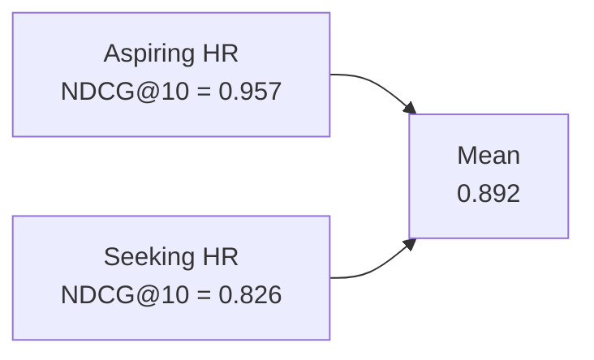
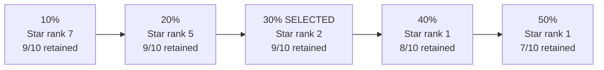
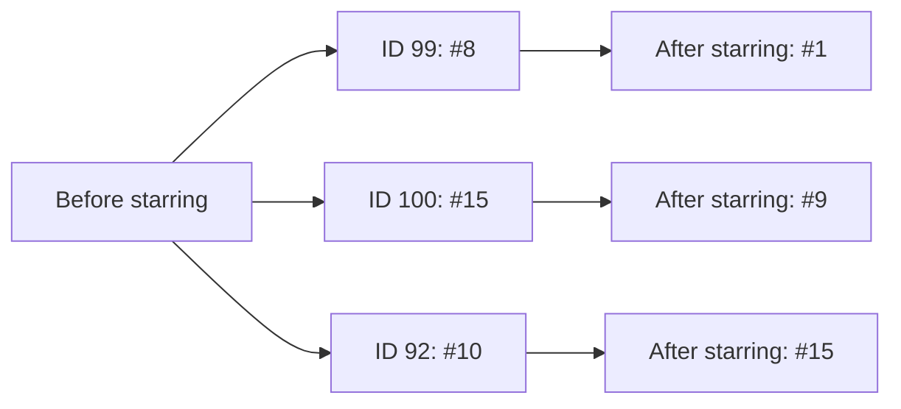

# Potential Talents - Candidate Ranking with Word2Vec and Rule-Based Relevance

## Executive Summary

This project develops a candidate-ranking workflow that combines **rule-based relevance screening, Word2Vec semantic ranking, and recruiter-driven reranking**. Evaluated across **52 unique job titles**, Word2Vec showed strong agreement with the rule-based relevance benchmark, while recruiter feedback successfully personalized the ranking without substantially disrupting the shortlist. The result is a practical approach for identifying relevant candidates, ranking them consistently, and adapting results as recruiter preferences become clearer.

## Problem Definition

Finding the right candidate is not simply a search problem - it is a ranking problem. Recruiters must translate a role's requirements into signals of candidate quality, sift through large pools of profiles, and decide which individuals deserve attention first. This project explores how that process can be made faster and more consistent by automatically scoring and ranking sourced candidates according to how well their professional background aligns with a recruiter's search intent.

The project assumes that a talent-sourcing company has already assembled a pool of potential candidates and now needs to determine which profiles best match a given role. The supplied dataset contains **104 anonymized candidate records**, each with a unique ID, `job_title`, location, connection count, and an initially unpopulated `fit` field. The sourcing stage is treated as complete; the analytical problem begins with scoring, ranking, reviewing, and reranking the available candidates.

## Data

Because both ranking approaches use only `job_title`, the analysis is performed on the **52 unique job titles** in the 104-record source dataset. Repeated occurrences of the same title do not provide new ranking information: they produce the same rule-based relevance and the same Word2Vec representation. Evaluating each unique title once therefore prevents frequently repeated titles from receiving disproportionate weight in the ranking metrics. The resulting title-level scores can still be mapped back to every original candidate ID for operational use. Location and connection count are retained as metadata but do not influence ranking.

| Dataset characteristic | Value |
|---|---:|
| Source candidate records | 104 |
| Unique job titles evaluated | 52 |
| Ranking feature | `job_title` |
| Recruiter queries | `aspiring human resources`, `seeking human resources` |

### Dataset Structure and Vocabulary

Exact-title frequencies are highly uneven: **14 of the 52 unique titles recur** in the 104 source rows, and the three most repeated titles each appear **7 times**. After deduplication, **31/52 titles (59.6%)** explicitly contain *Human Resources*, while **34/52 (65.4%)** contain direct HR evidence once standalone *HR* and CHRO-style signals are included. The target intent terms are common but not universal: **12 titles contain _aspiring_** and **10 contain _seeking_**. Common HR descriptors include *professional* (8 titles), *manager* (7), *generalist* (5), *management* (5), and *specialist* (4), while adjacent terms such as *staffing* (2) and recruiting/recruiter, talent, payroll, benefits, and compensation (1 each) are sparse. This pattern supports both parts of the design: frequent explicit role and intent terms provide auditable evidence for the rule-based reference, while the variation and sparsity of related HR vocabulary make exact keyword matching too brittle on its own and motivate Word2Vec semantic ranking. Counting unique titles rather than all 104 rows also prevents duplicated phrases from artificially dominating the frequency analysis or ranking metrics.

Candidates are first ranked according to their estimated relevance to the selected recruiter query. The ranking must then adapt when a recruiter stars a candidate as an ideal example.

## Ranking Study

The core study compares **two independent approaches to candidate ranking**.

### 1. Word2Vec Semantic Ranking

Before generating candidate vectors, words appearing in the 52 unique titles were checked directly against the **GoogleNews Word2Vec vocabulary**. Unresolved words were inspected individually, and preprocessing was defined from this audit: phone numbers and standalone years were removed, punctuation and hyphens were used to separate words, the structural connector `at` and isolated uppercase initials created by punctuation were dropped, exact-case lookup was followed by lowercase fallback, and possessives were reduced only when their base form already existed in the pretrained vocabulary. No external synonyms or semantic substitutions were introduced.

After preprocessing, **367 of 368 meaningful title-token occurrences (99.73%)** were represented, with `ENGIE` the only unresolved meaningful token and every title retaining at least one usable vector. The resulting **300-dimensional word vectors were averaged** to represent each `job_title` and recruiter query, and titles were ranked by cosine similarity to the query.

### 2. Rule-Based Relevance Ranking

The second approach converts explicit title evidence into a normalized relevance score:

$$R = H(0.70 + 0.30I)$$

where $H$ represents occupational relevance to the target role and $I$ represents alignment with the desired search intent.

For the HR searches used in this project, direct HR terms such as *Human Resources*, *HR*, *HRIS*, or *CHRO* receive the strongest occupational relevance, while recruiting, staffing, talent management, benefits, compensation, and related functions receive lower adjacent relevance. Intent distinguishes whether a title explicitly reflects **"aspiring"** or **"seeking"** Human Resources.

Because intent is multiplied by occupational relevance, generic phrases such as *seeking employment* cannot become HR-relevant simply because they contain the word *seeking*. A separate directionality rule also assigns zero relevance to clear employer solicitations, such as a staffing company seeking HR professionals.

## Word2Vec vs. Rule-Based Ranking

**NDCG@10** measures how closely the Word2Vec top-ten ordering agrees with the graded relevance produced by the rule-based method. The rule-based scores provide the relevance benchmark, while Word2Vec supplies the ranking being evaluated.

| Recruiter query | NDCG@10 |
|---|---:|
| Aspiring Human Resources | **0.957** |
| Seeking Human Resources | **0.826** |
| Mean | **0.892** |



Word2Vec reproduced the rule-based ordering very strongly for the aspiring-HR query but less consistently for the seeking-HR query. The main disagreements were interpretable. ID 75, an employer advertisement stating that a staffing company was *seeking Human Resources professionals*, ranked highly because Word2Vec recognized the relevant words but could not determine **who was seeking whom**. ID 92, which was seeking employment in Customer Service or Patient Care, also entered the Word2Vec top ten because *seeking* increased semantic similarity despite the absence of HR relevance. Longer titles also showed evidence of **mean-pooling dilution**, where highly relevant HR terms could be weakened by unrelated words receiving equal weight.

## Independent Human Relevance Assessment

As an additional human benchmark, the **52 unique job titles were manually assigned relevance grades from 0 to 3** using title information alone.

| Grade | Interpretation |
|---:|---|
| 0 | No meaningful HR relevance |
| 1 | Weak or adjacent HR relevance |
| 2 | Clearly HR-related |
| 3 | Strongest match with explicit target career intent |

The manual labels were kept separate from both ranking methods and were not used to train Word2Vec or determine the rule-based scores.

| Human vs. rule-based agreement | Result |
|---|---:|
| Exact ordinal agreement | **39/52 - 75.0%** |
| Quadratic weighted Cohen's kappa | **0.888** |
| Spearman correlation | **0.871** |

Most disagreements occurred between neighboring relevance levels rather than between clearly relevant and irrelevant titles.

## Recruiter Feedback and Dynamic Reranking

When a recruiter stars a candidate as an ideal example, the original Word2Vec search representation is shifted toward that candidate's job-title vector:

$$q_2 = \operatorname{normalize}(0.70q + 0.30d_\star)$$

The mechanism was tested across **34 unique ideal-title/query scenarios**. Title/query combinations with rule-based relevance scores of **0.85 to 1.00** were treated as strong matches, and each was starred one at a time before **all 52 unique titles were reranked**.

| Feedback weight | Median starred-title rank | Median original top-10 retained |
|---:|---:|---:|
| 10% | 7 | 9/10 |
| 20% | 5 | 9/10 |
| **30%** | **2** | **9/10** |
| 40% | 1 | 8/10 |
| 50% | 1 | 7/10 |



A **30% feedback weight** provided the best balance between personalization and ranking stability: the updated query retains 70% of the original recruiter search and incorporates 30% of the starred candidate representation.

Two representative examples show the effect:

| Query | Starred candidate | Rank change | Top-10 retained | NDCG@10 |
|---|---|---:|---:|---:|
| Aspiring HR | ID 3 - *Aspiring Human Resources Professional* | **4 -> 1** | 9/10 | 0.957 -> **0.959** |
| Seeking HR | ID 99 - *Seeking Human Resources Position* | **8 -> 1** | 8/10 | 0.826 -> **0.904** |



For the **seeking** query, ID 100, which explicitly seeks an entry-level Human Resources position, moved from **rank 15 to rank 9**, while ID 92, which seeks work in Customer Service or Patient Care rather than HR, fell from **rank 10 to rank 15**. Recruiter feedback therefore changes more than the starred candidate itself; it also reorganizes semantically similar and dissimilar candidates around it.

## Practical Implications

Titles receiving a **rule-based relevance score of 0** can be flagged for exclusion or recruiter review before shortlisting. This provides a transparent safeguard against obvious false positives while preserving Word2Vec's flexibility for ranking relevant candidates.

A universal cosine-similarity cutoff is unlikely to transfer safely across different roles because absolute Word2Vec similarity scores depend on the recruiter query and the vocabulary used in the candidate pool. Instead, the two ranking methods can serve different purposes: the rule-based score can first **flag profiles with no defensible role relevance**, while Word2Vec can then **rank the remaining candidates relative to one another**. This separates the question of *whether a profile belongs in the candidate pool at all* from the question of *which relevant candidates should appear first*, reducing the risk of rejecting strong candidates because of an arbitrary similarity threshold.

Importantly, the rule-based framework itself is not limited to Human Resources: $H$ can be generalized to represent relevance to any target role, while $I$ can represent alignment with any desired intent expressed in the search query. Scaling the approach therefore requires defining and validating new role- and intent-specific rules, but the underlying scoring structure can remain unchanged.

Automation can reduce some sources of inconsistency by applying the same relevance criteria and ranking procedure to every candidate rather than relying entirely on manual judgement. The rule-based method is explicit and auditable, while Word2Vec provides a consistent semantic ranking without using location or connection count as proxies for candidate quality. Automation should not, however, be treated as bias-free: pretrained embeddings can reflect patterns present in their training data, and recruiter selections can introduce human preferences into later rankings. Recruiter oversight, feedback logging, and periodic review therefore remain important.

## Limitations

- Mean-pooled Word2Vec does not reliably interpret **directionality**, such as distinguishing a candidate seeking HR work from an employer seeking HR professionals.
- Equal averaging can dilute important signals in long job titles.
- The ranking uses only `job_title`; relevant skills or experience absent from the title cannot influence fitness.
- New occupations require suitable role- and intent-specific rules to be defined and validated.

## Project Structure

The final project contains **exactly 10 files**: the original candidate dataset, a 52-title manually labelled dataset used only for independent human-relevance validation, three executed notebooks covering rule-based ranking, Word2Vec ranking, and recruiter-feedback reranking, the README, a Technical Report, a Business Recommendations report, `requirements.txt`, and `.gitignore`. The three README visuals are self-contained Mermaid diagrams, so no extra figure files or folders are required.

```text
project/
|-- README.md
|-- potential-talents.csv
|-- unique-job-titles-labelled.csv
|-- 01_data_rule_based_ranking.ipynb
|-- 02_stage1_word2vec.ipynb
|-- 03_recruiter_feedback.ipynb
|-- Technical_Report.pdf
|-- Business_Recommendations.pdf
|-- requirements.txt
`-- .gitignore
```

## Reproducibility

The project is implemented as a reproducible **Python workflow across three executed notebooks**. Notebook 01 recomputes the dataset audit, rule scores, and independent human-vs-rule validation entirely from the included CSV files. Notebooks 02 and 03 contain the complete GoogleNews Word2Vec ranking and feedback code; because the pretrained model is about 1.6 GB compressed, it is not bundled with the repository. Set `GOOGLE_NEWS_W2V_PATH` to a local GoogleNews binary (or set `ALLOW_GENSIM_DOWNLOAD=1`) to recompute the model-dependent results. When the external model is absent, those notebooks execute all model-independent checks and display the checked reference checkpoints explicitly rather than silently substituting a different embedding model. In live mode, assertions verify that the published rounded NDCG and feedback results are reproduced.

The required embedding is the Gensim `word2vec-google-news-300` / **3-million-word, 300-dimensional GoogleNews Word2Vec model**.
